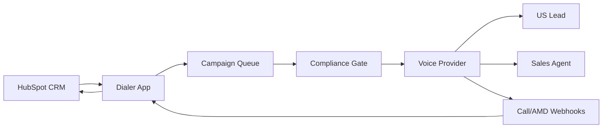

# TruckX Auto Dialer Architecture

## Goal

Build a standalone Kixie/CallTools-style dialer owned by your team, connected to HubSpot, and using a voice carrier such as Twilio, Plivo, or Telnyx for US outbound calling.

## Production Shape

## Core Pieces

- **Campaign Manager**: Select owner, list, max parallel lines, retry rules, caller ID pool, voicemail behavior.
- **HubSpot Connector**: Pull contacts by `hubspot_owner_id`, selected list, lifecycle stage, lead status, or workflow tag.
- **Dialer Engine**: Maintains queue, starts calls, caps parallel calls, tracks active calls, retries leads.
- **Compliance Gate**: Blocks DNC, missing consent, non-US numbers, outside recipient local calling window, and max-attempt violations.
- **Voice Provider Adapter**: Abstracts Twilio/Plivo/Telnyx so the app is not locked to one carrier.
- **Caller ID Pool**: Rotates configured US caller IDs from `CALLER_ID_NUMBERS`.
- **AMD/Voicemail Handling**: Uses carrier answering-machine detection to decide whether to bridge agent, drop voicemail, or mark VM.
- **HubSpot Writeback**: Updates lead status, last call outcome, attempts, and creates HubSpot call activities.

## MVP Choices In This Folder

- No paid dependencies.
- Node.js built-in HTTP server.
- Browser dashboard in `public/`.
- JSON file store in `data/store.json`.
- Mock voice provider by default.
- Twilio and Plivo starter adapters included for real calling integration.
- HubSpot owner sync and call activity writeback are scaffolded.

## Real Dialer Flow

1. Manager creates a campaign for a HubSpot owner or list.
2. App pulls matching leads from HubSpot.
3. Compliance gate filters leads.
4. Dialer starts up to N calls at once.
5. Carrier performs answering machine detection.
6. Live answer is bridged to an available agent.
7. Voicemail is logged or voicemail-drop is triggered.
8. Call outcome updates HubSpot.

## What Needs A Public URL

Real carriers need webhooks for answer, status, and machine-detection callbacks. Localhost is fine for mock mode, but production needs HTTPS:

- `POST /webhooks/twilio/status`
- `POST /webhooks/twilio/answer`
- `POST /webhooks/plivo/status`
- `POST /webhooks/plivo/answer`

## Next Live Integration Steps

1. Add HubSpot private app token and set `LEAD_SOURCE=hubspot`.
2. Sync HubSpot owners into TruckX Auto Dialer.
3. Add carrier credentials and set `VOICE_PROVIDER=twilio` or `VOICE_PROVIDER=plivo`.
4. Add purchased/verified US caller IDs to `CALLER_ID_NUMBERS`.
5. Set `PUBLIC_BASE_URL` to a public HTTPS URL so the carrier can call the webhooks.
6. Run one controlled test campaign with one owner and one test contact before opening live calling.
